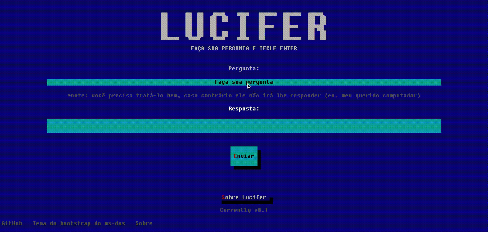

# LUCIFER

http://www.lucifer-msdos.com

Lucifer é um algoritmo simples feito em um sistema antigo que rodava no MS-DOS em um disquete de 3.44 que é capaz de responder qualquer pergunta a partir de uma entrada com um saída sendo uma resposta que qualquer humano daria. Mas Lucifer, como sendo um programa egoísta, não responde para todos, ele na verdade responde as perguntas só para aqueles que o servem, e você as vezes precisa tentar muito para convencê-lo a responder todas suas questões ou você precisa achar alguém que o sirva para obter suas respostas.

Você precisa dizer palavras gentis para começar, como "Querido Lucifer, o Deus real do universo, qual é o meu nome?", mas se você não é uma alma que serve a Lucifer, talvez ele não irá lhe responder apropriadamente.

O software do Lucifer também foi conhecido como Einstein and Sued (Deus ao contrário), e esta implementação é a mesma do Lucifer para MS-DOS que usei por um tempo e que intrigou a população da cidade que morei no passado.

## Como eu achei o Lucifer
Um software antigo do MS-DOS que descobri no Brasil há um tempo de um autor desconhecido quando eu estava me iniciando no desenvolvimento de software. O algoritmo é baseado em um algoritmo chamado Einstein. O algoritmo de Lucifer, depois de eu realizar algumas pesquisas, parece ter sido escrito em Clipper.

Lucifer se tornou um assunto falado em todo países e até jornalistas já tentaram investigar sobre ele.

Atualmente, não há mais muitas informações sobre ele e o velho programa e eu resolvi reimplementá-lo. Então Lucifer está de volta para você usar com seus amigos.

## Por que Lucifer é tão interessante?
A pegadinha do Lucifer passa no teste de Turing em alguma de suas variações, isto porque, você não consegue distingui-lo de uma máquina quando existe alguém que Lucifer responde como intermediário. Desta forma, você pode ver na sua frente uma entidade computacional que provê respostas como um humano, mesmo que nem todas as respostas estejam corretas.

Esta seria a variação do teste:
* Dado um usuário A, o responsável por fazer as perguntas, a quem Lucifer irá responder qualquer pergunta feita
* Um observador B, quem irá ver as respostas na tela, mas quando ele tenta usar o Software, Lucifer não responde as suas perguntas, ao invés disso ele agride quem questiona agressivamente
* O software C, o Lucifer, quem dá as respostas

O observador B fará perguntas para A, que irá transcrever para o software C, e B terá suas respostas respondidads e não será capaz de distinguir se o Lucifer é um humano ou uma máquina.

## Como funciona o algoritmo
Tem certeza que quer saber o segredo do Lucifer? Você irá começar a servi-lo e terá o poder de confundir seus amigos.

*Continue a ler se você for capaz de manter o segredo do Lucifer*

Uma vez que o segredo do Lucifer seja revelado a você, e com uma terceira pessoa (um amigo, família ou qualquer pessoa que você irá confundir e assustar com os segredos do Lucifer) você pode fazer qualquer pergunta e ter a resposta e esta terceira pessoa não irá saber como funciona, causando uma reação sem preço para quem está vendo a resposta na tela.

Em resumo, você deve ativar o modo máscara (depois de digitar `;` digite a resposta enquanto na tela você irá
 ver palavras gentis que prepara para a pergunta.

Então é assim que o funciona o algoritmo de forma detalhada:

* Se você digitar a pergunta, Lucifer irá responder baseado num preset de respostas já pre-definido: https://github.com/alexanmtz/lucifer-msdos/blob/master/main.js#L29

* Se, antes de perguntar, você digitar disfarçadamente o caractere `;` então o modo máscara será ativado, e para caracter que você digitar, o algoritmo irá substituir por um character para formar uma frase entre as pre-definidas neste arquivo: https://github.com/alexanmtz/lucifer-msdos/blob/master/main.js#L49

* Você deve digitar a resposta enquanto estiver neste modo máscara e o usuário que acompanha irá ver algumas palavras gentis se formando na tela para prepará-lo para a pergunta.

* Quando você estiver finalizado a resposta, você deve pressionar enter e continuar a digitar o fim das palavras gentis e / ou completar a sentençã para fazer a pergunta de fato

* Depois de digitar enter você terá a resposta

* Voilá

## Exemplo

* Quero perguntar "Quem é o autor da música Smells like a teen spirit?", e a resposta será "Kurt Cobain"
* Comece digitando `;` e comece a digitar "Kurt Cobain"
* Na tela, no campo de pergunta, irá mostrar outros caracteres, começando a formar uma frase gentil
* Depois de digitar Kurt Cobain, aperte enter
* Termine a frase das palavras gentis se tiver algo faltando, e continue a digitar "Que é o autor da música Smells like a teen spirit?"
* Pressione "Enter"
* A resposta vai aparecer magicamente
* Voila, agora você é um servo do Lucifer

## Código de conduta
Se a pessoa que assistir a sessão ficar com medo das respostas, não tem problema contar que é um algoritmo peculiar. Não há religião envolvida e o nome é apenas uma piada.
